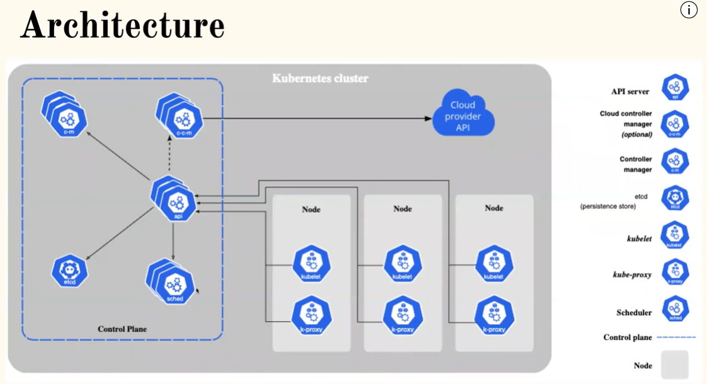

Kubernetes Architecture
------------------------

* In Kubernetes, there are two components:
    * Control Plane (Master nodes): 
        * Responsible for controlling all the actions
    * Data Plane (Worker nodes): 
        * Responsible for executing all the actions

### Master nodes or Control Plane

* In k8s Control Plane, there are Five components
    * api-server
    * scheduler
    * etcd
    * controller
    * cloud controller manager

### Worker nodes or data plane

* In k8s worker nodes, we have three components:
    * kubelet
    * kube-proxy
    * container runtime

* Kubernetes supports 
    * clusters 
    * auto scaling 
    * auto healing  
    * enterprise level support
* In Docker, the smallest unit is `container` and in Kubernetes, the smallest unit is `Pod`
* Whenever a container is created, it does not run automatically. We need to have a `Container Runtime Interface (CRI)` to run a container.
* `Docker shim` is the CRI in Docker
* In k8s, we have master or control plane and worker nodes
* Any request in kubernetes is received by the control plane and passed to the worker nodes
* `kubelet` is responsible for running pods and maintaining them
* `kube-proxy` provides networking in k8s
* `api-server` is the heart of k8s
* `scheduler` is responsible for scheduling the pods and resources on k8s
* The entire k8s cluster information is stored as objects or key value pairs in `etcd`
* `Replica set` is like a `controller` in k8s
* If the k8s cluster is created on _on-premises_, there is no need of creating the component `cloud controller manager`
* `kubectl` is a command line for k8s

Kubernetes architectural components
-------------------------------------

[Refer here for detailed notes](https://directdevops.blog/2019/10/10/kubernetes-master-and-node-components/) `MUST READ`

### api-server

* Kubernetes is like a captain of the ship who actually carries the containers
* In k8s, there is an `api server` in control plane  
* All the communication (internal and external) in k8s is handled by `api-server`
* api server is responsible for all types of communication of k8s

### etcd

* `etcd` is the memory(storage, backups etc..) of k8s cluster. It is not developed by k8s. It is a third party component. It stores the information about the pods running but not about what is running inside the pod. To solve this, we can use something called `labels` in k8s. So, the information about what is running inside the pod can be identified using `labels`. K8s identifies all the resources with the help of `labels`

### kubectl

* `kubectl`: kubectl is a command line way of interacting with k8s cluster. A user speaks with `kubectl` (through command line) and `kubectl` speaks with `api-server` of k8s [yaml format]

* User can approach k8s through `rest-api` way also [json format]

### manifest

* `manifest`: user passes the instructions in a `manifest` which is received by the `api-server` and the api-server stores that information in `etcd`

### scheduler

* `scheduler`: anything new to be created (checks from `etcd`) is done by `scheduler`. Out of all the available servers, it finds a suitable server and runs the container on it.

### controller

* `controller`: It is responsible for maintaining the state i.e., actual state=desired state.

### kubelet

* `kubelet`: It is the agent of control plane. On every worker node, there will be one `kubelet` present. Whenever scheduler wants to create something, it speaks with the `kubelet`. This is the component that communicates between control plane and node. kubelet can create containers for those who follow a standard called CRI

* `Container Runtime Interface(CRI)`: kubelet can speak with any container technology as long as it is a CRI compliant. CRI is the standard for k8s to support any container technology

### other important terms

* `kube-proxy`: It helps in dealing with some of the network aspects of the pod

* `Cloud Controller Manager`: related to eks and aks etc i.e when we use EKS on AWS, this component has the knowledge of all the AWS related resources and when when we use AKS on azure, this component has the knowledge of all the azure related resources

* `service`: equivalent to a layer 4 load balancer

Kuberenetes Installation (Kube-adm setup)
-----------------------------------------

* [Refer here](https://directdevops.blog/2024/01/23/devops-classroom-notes-23-jan-2024/) for kube-adm setup

Kubernetes Production Systems
------------------------------

### Kubernetes distributions

* Kubernetes with tools that make the installation easier and come with other add-ons are known as a Kubernetes distribution.
* 9 Popular Kubernetes Distributions
    * Google Kubernetes Engine (GKE) ...
    * Azure Kubernetes Service (AKS) ...
    * Rancher. ...
    * Red Hat OpenShift. ...
    * Docker Kubernetes Service (DKS) ...
    * Amazon Elastic Kubernetes Service (EKS) ...
    * VMware Tanzu Kubernetes Grid (TKG) ...
    * Mirantis.

### KOPS

* Kubernetes Operations (KOPS)
* The lifecycle of k8s is managed by KOPS and it is most widely used fot installing k8s