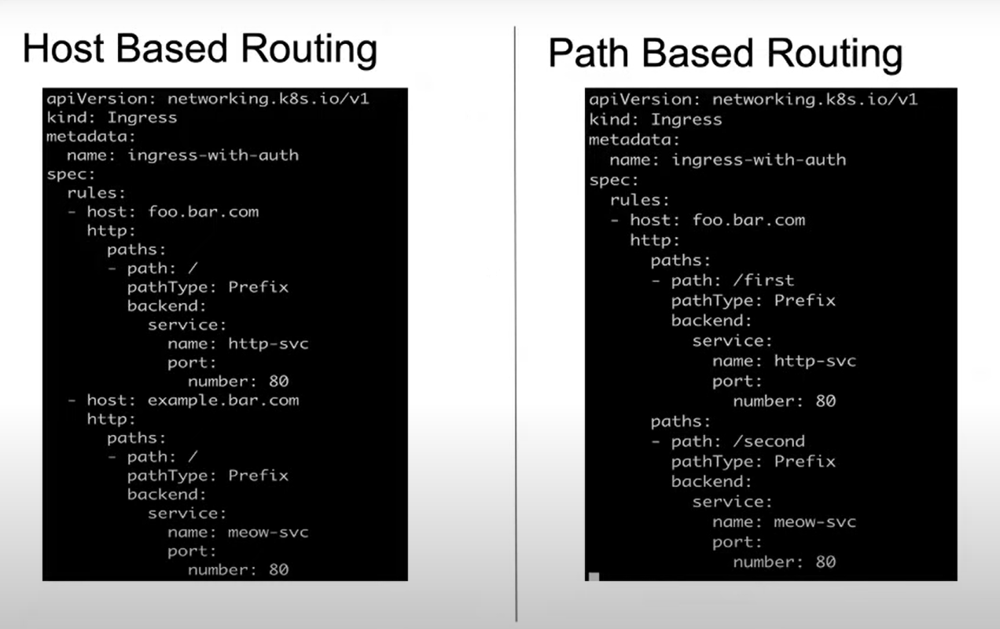

Kubernetes Ingress
-------------------

### Microservice

[Refer here for detailed notes](https://directdevops.blog/2023/12/31/devops-classroom-notes-31-dec-2023/)
 
* These category of applications where you have a smaller component of the application running on its own with its own database is called a `microservice`
* The basic concept of microservice is it is a smaller component which can run individually and for each microservice we write a `deployment`
* Every microservice has a service 
* All internal communications will be via `service` and external communications via `loadbalancer`

### Ingress

[Refer here for official docs](https://kubernetes.io/docs/concepts/services-networking/ingress/)

* Ingress exposes HTTP and HTTPS routes from outside the cluster to services within the cluster. 
* Traffic routing is controlled by rules defined on the Ingress resource.
* Ingress cannot run on it own. Whenever we create an ingress, we also need to create an `Ingress Controller`
* Here is a simple example where an Ingress sends all its traffic to one Service:


* Simple ingress YAML

```yaml
apiVersion: networking.k8s.io/v1
kind: Ingress
metadata:
  name: test-ingress
spec:
  defaultBackend:
    service:
      name: test-service
      port:
        number: 80       
```

* Sample ingress YAML

```yaml
apiVersion: networking.k8s.io/v1
kind: Ingress
metadata:
  name: minimal-ingress
spec:
  ingressClassName: nginx-example
  rules:
  - http:
      paths:
      - path: /testpath
        pathType: Prefix
        backend:
          service:
            name: test
            port:
              number: 80
```
* Host-based and Path-based routing



### Ingress Controller

[Refer here official docs](https://kubernetes.io/docs/concepts/services-networking/ingress-controllers/)

* Ingress Controller is loadbalancer that we can choose from the requirements
* Ingress Controller looks for the ingress resources and updates and configures the load balancer
* The configuration of ingress varies from controller to controller, it can sometimes be inside the cluster or outside the cluster

### Why Ingress over Service?

* While running an application, say for example there are 100 microservices running within the application, we need to create 100 `services` for each of the microservice which is not effective
* So, to solve this we create an `ingress` and with an `ingress controller` and it will route the traffic to the service
* Ingress is an API object in Kubernetes that manages external access to services within a cluster. 
* It allows you to define how external HTTP/S traffic should be routed to your services based on rules.
* Ingress is particularly useful for handling HTTP and HTTPS traffic, providing features like path-based routing, SSL termination, and load balancing. 
* It acts as a `layer 7 (application layer)` load balancer.


