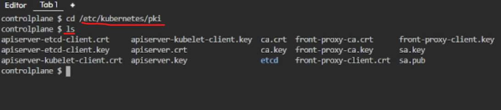
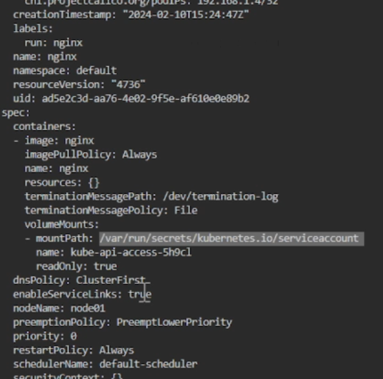
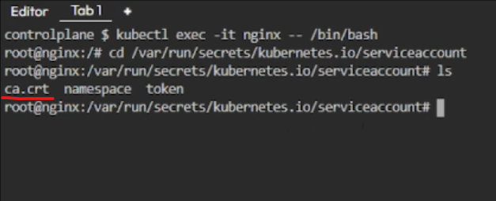

Docker Compose
---------------

* Any application running inside the docker container is generally suppoosed to be a `service` in docker compose
* Each of the service is supposed to be a container

Kubernetes RBAC
---------------

[Refer here for full notes with yaml examples](https://directdevops.blog/2024/02/10/devops-classroom-notes-10-feb-2024-2/)

* Kubernetes RBAC(Roll Back Access Control) deals with `User Management` in k8s
* K8s will not have the `user` information stored in it locally, but the `ServiceAccount` information is stored in __etcd__
* K8s stores the `RoleBinding` and `ClusterRoleBinding` which contains the `user information`. This is how k8s authenticates and authorizes the users because _users_ are external and _ServiceAccounts_ are internal components to k8s
* Check for permissions using the below commands
```bash
kubectl auth can-i list pods
kubectl auth can-i delete deployments
```
* Kubernetes RBAC:
    * Role: To give permissions at `namespace` level
    * ClusterRole: To give permissions at `Cluster` level

### Secure Connections in k8s - Certificate Authority

* __Encryption__ is of two types:
    * Symmetric Encrption: same keys for encrypting and decrypting
    * Asymmetric Encrption: different keys(public key and private key) for encrypting and decrypting
* __Certificate Authority(CA)__ is of two types:
    * Public Certificate Authority
    * Private Certificate Authority
* Kubernetes connections are secured by default, because kubernetes has its own internal certificate authority
* In `kubeadm` setup, we can check for that as follows:
```bash
cd /etc/kubernetes/pki
ls
```

* For kubernetes cloud setup, Cloud providers will not give access to the certificate authorities

### automountServiceAccountToken

* In k8s, when we create any pod, in one folder `/var/run/secrets/kubernetes.io/serviceaccount` inside the container, a volumeMount will be created with CA certificate mounted to it which is not a good practice


* So, always __disable__ automounting service account tokens in PodSpec