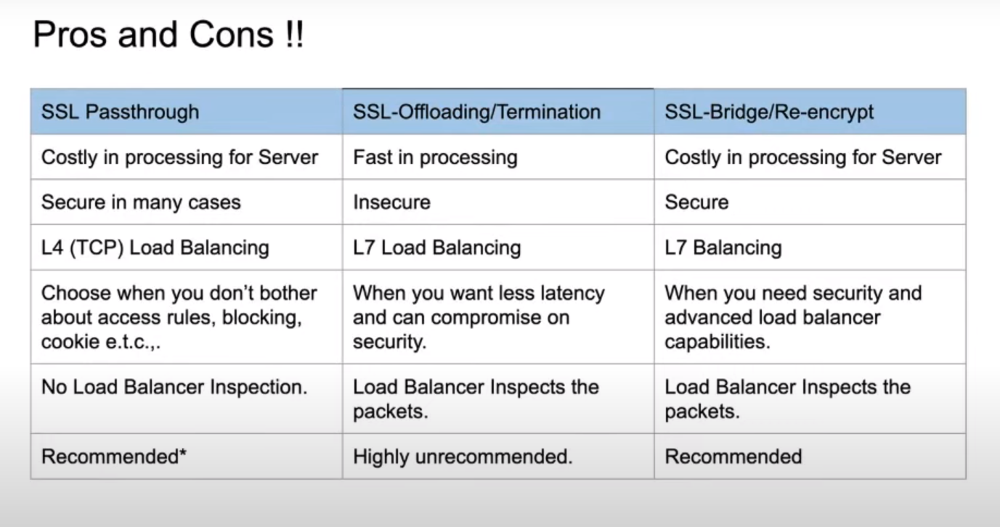

TLS
----

### SSL Passthrough (Secure Ingress)

* This is a secured approach as it passes `encrypted` traffic directly without decrypting at the loadbalancer but it has some drawbacks as well

### SSL Offloading

* This is not at all secure approach as the data is `decrypted` and sent as `plain text`

### SSL Bridging

* This is the more secure approach as data is `decrypted` first and `re-encrypted` data is sent forward

### Overview

