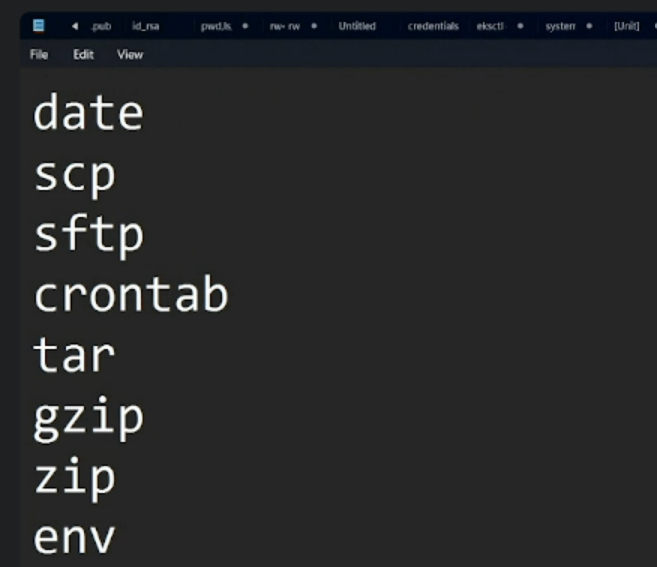
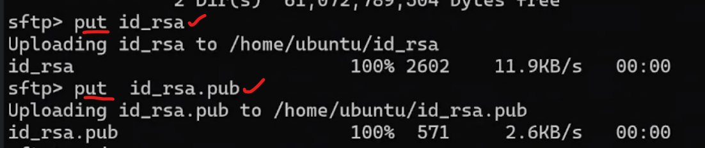
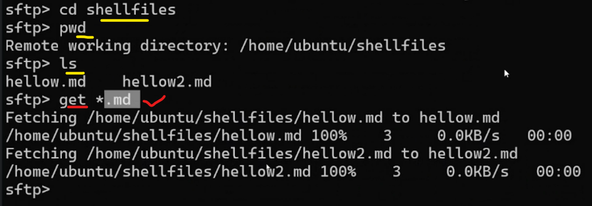
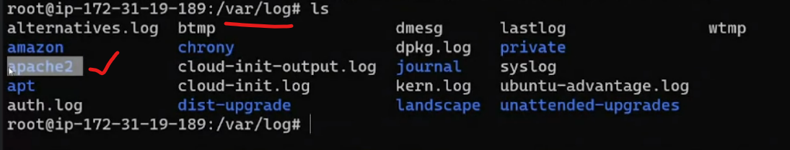

### Linux concepts



### date
* `date`: displays the current date and time (for more info date --help)
* `date +"%d"`: displays the date i.e., 25
* `date +"%d-%m-%y"`: displays date, month and year i.e., 25-11-23

### scp
* `scp`: Secure Copy file Protocol. To copy/upload any file from local to remote machine
```bash
scp <source-file-name> user@<public-ip>:<dest-path>
scp .\develop.sh ubuntu@52.23.165.157:/home/ubuntu/develop.sh
or
scp -i <privatekey-pemfile-path> <source-file-name> user@<public-ip>:<dest-path>
```

### sftp
* `sftp`: Secure File Transfer protocol. To download files from remote to local machine
* Connect to sftp
```bash
sftp -i <privatekey-pemfile-path> user@<public-ip>
```
* After connecting to sftp, use `put`, `get`
*  `put`: this command uploads local files to remote
```bash
put <local-file-name>
```

* `get`:  this command uploads remote files to local
```bash
get <remote-file-name>
```


* `ls` and `lls`
* `pwd`: Remote wordir
* `lpwd`: local workdir
* `cd` and `lcd`
* Check for `pwd`and `lpwd` in `sftp`

### crontab
* `crontab`: To run a particular job on particular time based on cron expressions. It does the work of cron job in Linux machine (crontab syntax website: crontab.guru)
* `chmod +x <file-name>`: execution permissions to a particular file

### tar
* `tar`: to compress the files or zip files
* tar -cf: c: compress; f: file
* tar -tvf: t: time; v: verbose(to show the logs); f: file
* tar -cvzf: z: zip the tar file
* tar -cvzf: when used z: zip, file name should be .gz extension (file.tar.gz)
* tar -xf: x: extract; f: file

### logs
* `logs`: troubleshoot errors based on loga
* `/var/log`:  default linux machine logs folder. Any installed application logs will be present in this folder. For example, when we install apache2 the logs would be present in `/var/log/apache2 `

* `/var/log/syslog`: default system logs

### environmental variables
* `env`:  environmental variables
```bash
export sysname=developer
echo $sysname
Output: developer
```
* The above example is temporary environmental variable
```bash
echo "export sysname=developer" >> ~/.bashrc
echo $sysname
Output: developer
```
*  The above example is permanent environmental variable