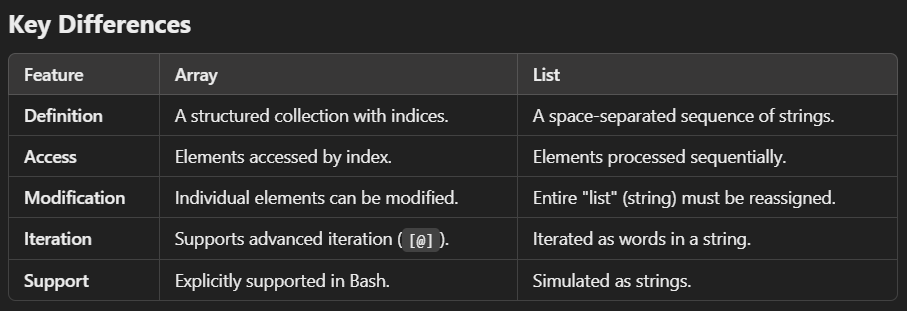

Arrays
------

* `Definition`: An array is an indexed collection of elements, where each element is associated with a numerical index.

### Key Characteristics of Arrays

* Indexed numerically (starting from 0).
* Elements can be accessed and modified using their index.
* Arrays are explicitly supported in most modern shells like Bash.
* Example:

```bash
# Declare an array
fruits=("apple" "banana" "cherry")

# Access elements
echo "${fruits[0]}"  # Outputs: apple
echo "${fruits[2]}"  # Outputs: cherry

# Add or modify elements
fruits[3]="orange"
echo "${fruits[3]}"  # Outputs: orange

# Iterate over elements
for fruit in "${fruits[@]}"; do
  echo "$fruit"
done
```
### Important Array Operators:

* `${array[@]}`: All elements of the array.
* `${#array[@]}`: Number of elements in the array.
* `${array[index]}`: Access specific element by index.

Lists
-----

* `Definition:` A list in shell scripting typically refers to a sequence of commands or strings that are processed as a group.

### Key Characteristics of Lists

* Not explicitly supported as a data structure.
* Often refers to a list of space-separated words or commands.
* Can be simulated using strings or arrays.
* Example:

```bash
# A simple space-separated list of items (not an array)
items="apple banana cherry"

# Iterate over the list
for item in $items; do
  echo "$item"
done
```
* This approach treats the string items as a space-separated "list."

### Key Differences b/w an array and a list



### Conclusion
* Use arrays if you need indexed and structured data storage.
* Use a list (as a string) for simple sequential processing or passing space-separated values.