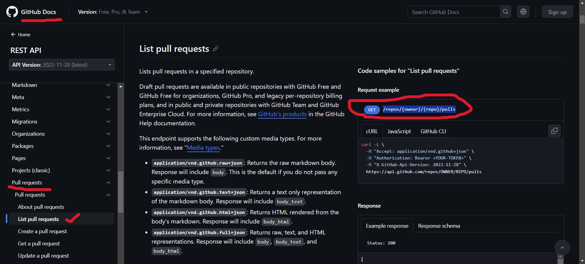

Dictionaries
------------

* Key-value pair to store properties
* Syntax:
```python
Student_details = {
    "name": "John",
    "age": 15,
    "class": "X",
    "Gender": "male"
}

print(Student_details["name"])
```

```python
Students_info = [
    {
        "name": "John",
        "age": 15,
        "class": "X",
        "Gender": "male"
    },
    {
        "name": "Tim",
        "age": 14,
        "class": "IX",
        "Gender": "male"
    },
    {
        "name": "Kay",
        "age": 16,
        "class": "XI",
        "Gender": "female"
    }
]

print(Students_info[0]["age"])
```

### Get _pull requrests information_ of a github repository using python

* Use `request` module of python to connect to github API (Url)
    * `Requests` module in python is used to connect with APIs and accessing the Urls
* To get the `github pull requests url`, 
    * Navigate to "github api docs" --> pull requests
    
* Convert `JSON` to `dictionary` format as it is easy for python to perform operations using dictionaries
* Print the required output

```bash
# install request module through cmd
pip install requests
```
```python
import requests

response = requests.get("https:api.github.com/repos/kubernetes/kubernetes/pulls")

print(response.json())
```